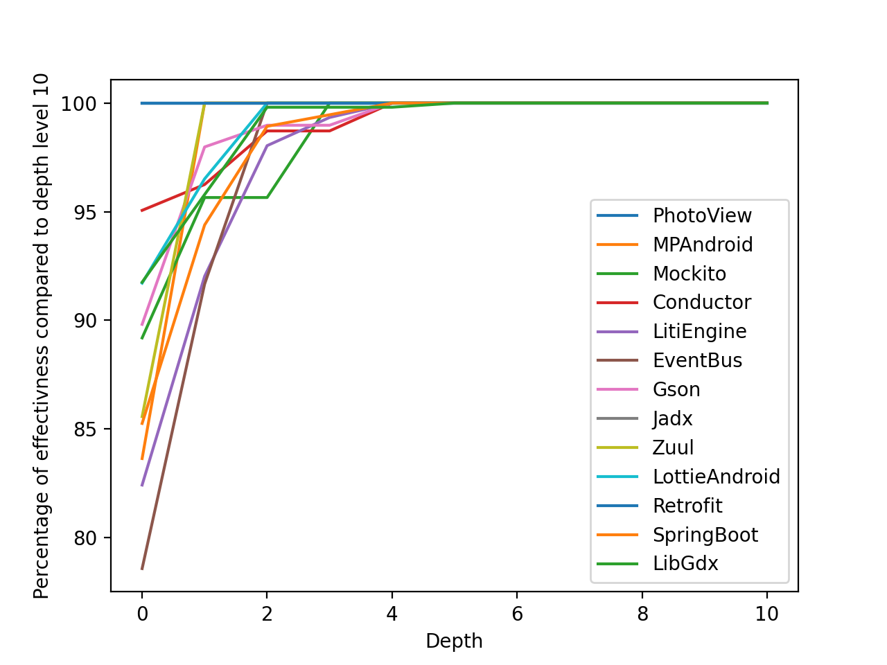

## Runner
This sections describes how to run [Annotator](../README.md) on any project.

### Installation
Annotator is written entirely in Java and delivered via a `jar` file located in `jars` directory. 
To re-create/update the `jar` file, run `./update.sh`

### Requirements for the Target Project

Below are the instructions to prepare the target project:

#### Dependencies
1. `NullAway` checker must be activated with version >= `0.9.7`
2. `TypeAnnotatorScanner` checker must be activated with version >= `1.2.6-LOCAL`, see more about `TypeAnnotatorScanner` [here](../type-annotator-scanner/README.md).

#### Error Prone Flags
```
"-Xep:NullAway:ERROR", // to activate NullAway
"-XepOpt:NullAway:SerializeFixMetadata=true",
"-XepOpt:NullAway:FixSerializationConfigPath=path_to_nullaway_config.xml",
"-Xep:TypeAnnotatorScanner:ERROR", // to activate Annotator TypeAnnotatorScanner
"-XepOpt:TypeAnnotatorScanner:ConfigPath=path_to_scanner_config.xml",
```

`path_to_nullaway_config.xml` and `path_to_scanner_config.xml` are config files which **are not necessary** to create at the time of preparing the project. 
These two files will be created by the script and enables the communication between the script and the analysis.

Please find a sample project setup below:
```groovy
dependencies {
    annotationProcessor "edu.ucr.cs.riple:nullaway:0.9.6"
    annotationProcessor "edu.ucr.cs.riple.nullawayannotator:type-annotator-scanner:1.1.1-LOCAL"
    compileOnly "com.google.code.findbugs:jsr305:3.0.2"
    errorprone "com.google.errorprone:error_prone_core:2.3.2"
    errorproneJavac "com.google.errorprone:javac:9+181-r4173-1"
}

tasks.withType(JavaCompile) {
    if (!name.toLowerCase().contains("test")) {
        options.errorprone.errorproneArgs += ["-XepDisableAllChecks",
                                              "-Xep:NullAway:ERROR",
                                              "-XepOpt:NullAway:AnnotatedPackages=com.uber",
                                              "-XepOpt:NullAway:SerializeFixMetadata=true",
                                              "-XepOpt:NullAway:FixSerializationConfigPath=/tmp/NullAwayFix/config.xml",
                                              "-Xep:TypeAnnotatorScanner:ERROR",
                                              "-XepOpt:TypeAnnotatorScanner:ConfigPath=/tmp/NullAwayFix/scanner.xml",
        ]
    }
}
```
At this moment, the target project is ready for the Annotator to process. 

We need to inform the `Annotator` about `path_to_nullaway_config.xml` and `path_to_scanner_config.xml` (number 2 and 3 in the next section), please read the section below.

### Running Annotator
`Annotator` is delivered via a `jar` file. To run the `jar` file simply run the command below:
```shell
cd jars && java -jar core.jar
```
`Annotator` requires certain flag values to be able to run successfully. We can pass these values via command line arguments or config files, we will describe each approach in next sections.
#### Use Command Line Arguments

In order to run `Annotator` on target project `P`, arguments below **must** be passed to `Annotator`:
1. `-bc,--build-command <arg>`: Command to run `NullAway` on target `P` enclosed in **""**. Please note that this command should be executable from any directory (e.g. `"cd /Absolute /Path /To /P && ./build"`).
4. `-i,--initializer <arg>`: Fully qualified name of the `@Initializer` annotation.
5. `-d,--dir <arg>`: Directory where all outputs of `TypeAnnotatorScanner|NullAway` are serialized.

By default, `Annotator` has the configuration below:
1. Lexical Preservation is enabled.
2. When a tree of fixes is marked as useful, it only injects the root fix.
3. Annotator will bailout from the search tree as soon as its effectiveness hits zero or less.
4. Performs search to depth level `5`.
5. Uses `javax.annotation.Nullable` as `@Nullable` annotation.
6. Caches iterations results and uses them in the next cycles.
7. Uses optimization techniques to parallelize search.

Here are __optional__ arguments which can alter default configurations above:
1. `-dlp,--disable-lexical-preservation`: Disables Lexical Preservation.
2. `-ch,--chain`: Injects the complete tree of fixes associated to the fix.
3. `-db,--disable-bailout`: Annotator will not bailout from the search tree as soon as its effectiveness hits zero or less and completely traverses the tree until no new fix is suggested.
4. `-depth,--depth <arg>`: Sets the depth of the analysis search.
5. `-n,--nullable <arg>`: Sets custom `@Nullable` annotation.
6. `-dc,--disable-cache`: Disables cache usage.
7. `-do,--disable-optimization`: Disables optimizations.

#### Example
```shell
cd jars && java -jar core.jar -bc "cd /Path /To /P && ./gradlew compileJava" -ccp path_to_scanner_config.xml -ncp path_to_nullaway_config.xml -i com.custom.Initializer -d /tmp --disable-optimization -dlp
```

The command above will process project `P` in non-optimized mode and disables lexical preservation features.


#### Use config file

In this approach we will initialize all flag values in one single file, and pass the path to the `Annotator`.
See the format of the config file below with sample values:
```json
{
  "BUILD_COMMAND": "cd Absolute/ Path/ to/ Target && Command to run NullAway",
  "ANNOTATION": {
    "INITIALIZER": "foo.bar.Initializer",
    "NULLABLE": "javax.annotation.Nullable"
  },
  "LEXICAL_PRESERVATION": false,
  "OUTPUT_DIR": "/tmp/NullAwayFix",
  "NULLAWAY_CONFIG_PATH": "/tmp/NullAwayFix/config.xml",
  "SCANNER_CONFIG_PATH": "/tmp/NullAwayFix/scanner.xml",
  "CHAIN": true,
  "OPTIMIZED": true,
  "CACHE": true,
  "BAILOUT": true,
  "DEPTH": 1
}
```
Below is the description of each setting:

1. `BUILD_COMMAND`: The command to execute `NullAway` for the project. (This command must include changing directory to target project from root) 
2. `INITIALIZER`: Fully qualified name of the `Initializer` annotation to inject on detected initializer methods.
3. `NULLABLE`: Fully qualified name of the `Nullable` annotation.
4. `LEXICAL_PRESERVATION`: If set to `true`, activates lexical preservation.
5. `OUTPUT_DIR`: Directory where the serialized output of NullAway should be written.
6. `NULLAWAY_CONFIG_PATH`: `path_to_config.xml` given to project in time of preparing the project (previous section).
7. `SCANNER_CONFIG_PATH`: `path_to_scanner.xml` given to project in time of preparing the process (previous section).
8. `OPTIMIZED`: Enables the optimization technique.
9. `CACHE`: if set to `true`, cache usage will be enabled.
10. `BAILOUT`: if set to `true`, Annotator will bailout from the search tree as soon as its effectiveness hits zero or less, otherwise it will completely travers the tree until no new fix is suggested
11. `DEPTH`: The depth of the analysis.

Pass the path to the config file above with `-p,--path` argument to `core.jar` and no other flag is required.

#### Example
```shell
cd jars && java -jar core.jar --path config.json
```


### Helper script

`start.sh` script is provided, you can run `Annotator` and simply pass desired arguments to `start.sh`.
#### Example
```shell
./start.sh --path config.json

or

./start.sh -bc "cd /Path /To /P && ./gradlew compileJava" -ccp path_to_scanner_config.xml -ncp path_to_nullaway_config.xml -i com.custom.Initializer -d /tmp --disable-optimization -dlp
```

To see all flags description simply run `./start.sh --help`
```cmd
 -bc,--build-command <arg>             Command to Run NullAway on the
                                       target project, this command must
                                       include changing directory from
                                       root to the target project
 -scp,--scanner-config-path <arg>          Path to the Scanner Config
 -ch,--chain                           Injects the complete tree of fixes
                                       associated to the fix
 -d,--dir <arg>                        Directory of the output files
 -db,--disable-bailout                 Disables bailout, Annotator will
                                       not bailout from the search tree as
                                       soon as its effectiveness hits zero
                                       or less and completely traverses
                                       the tree until no new fix is
                                       suggested
 -dc,--disable-cache                   Disables cache usage
 -depth,--depth <arg>                  Depth of the analysis
 -dlp,--disable-lexical-preservation   Disables lexical preservation
 -do,--disable-optimization            Disables optimizations
 -h,--help                             Shows all flags
 -i,--initializer <arg>                Fully Qualified name of the
                                       Initializer annotation
 -n,--nullable <arg>                   Fully Qualified name of the
                                       Nullable annotation
 -ncp,--nullaway-config-path <arg>     Path to the NullAway Config
 -p,--path <arg>                       Path to config file containing all
                                       flags values in json format
```

### Annotator Depth Level

Regarding `Annotator Depth level`, the number of remaining warnings will reduce as the depth increases. However, in our experiments,
level 5 is the sweet spot for having the best performance. Please look at the chart below, running the core from level 0 to 10 over 20 open source projects. As you can see, on level 4 we reach the optimal solution.


